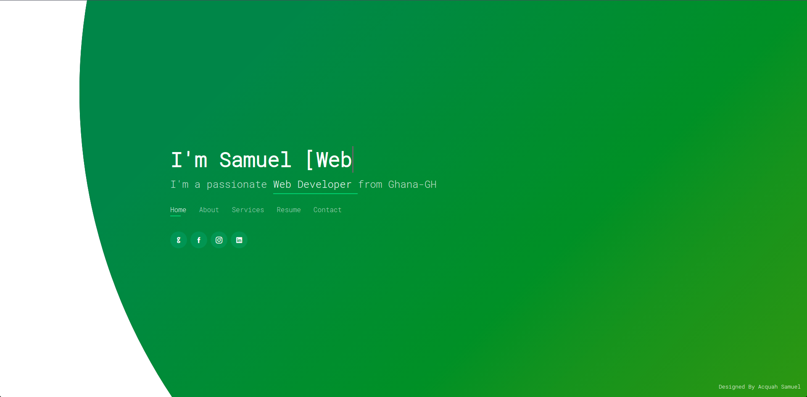
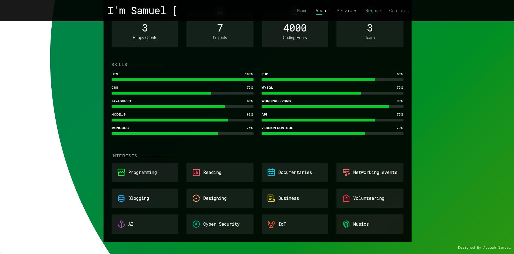

### profile
 Self-motivated Software Developer with high level of experience working on multiple projects.
 Passionate and hardworking with penchant for meeting deadlines. 
 Interested in role with company promoting best practices and offering diverse customer projects. 
 Quickly learn and master new technologies and working in both team and self-directed settings.

 

### Built With
This section should list any major frameworks that you built your project using. Leave any add-ons/plugins for the acknowledgements section. Here are a few examples.
* [Html5](https://jquery.com)
* [CSS3](https://laravel.com)
* [SaSS](https://getbootstrap.com)
* [Bootstrap](https://getbootstrap.com)
* [Javascript](https://jquery.com)
* [PixelBay](https://laravel.com)

